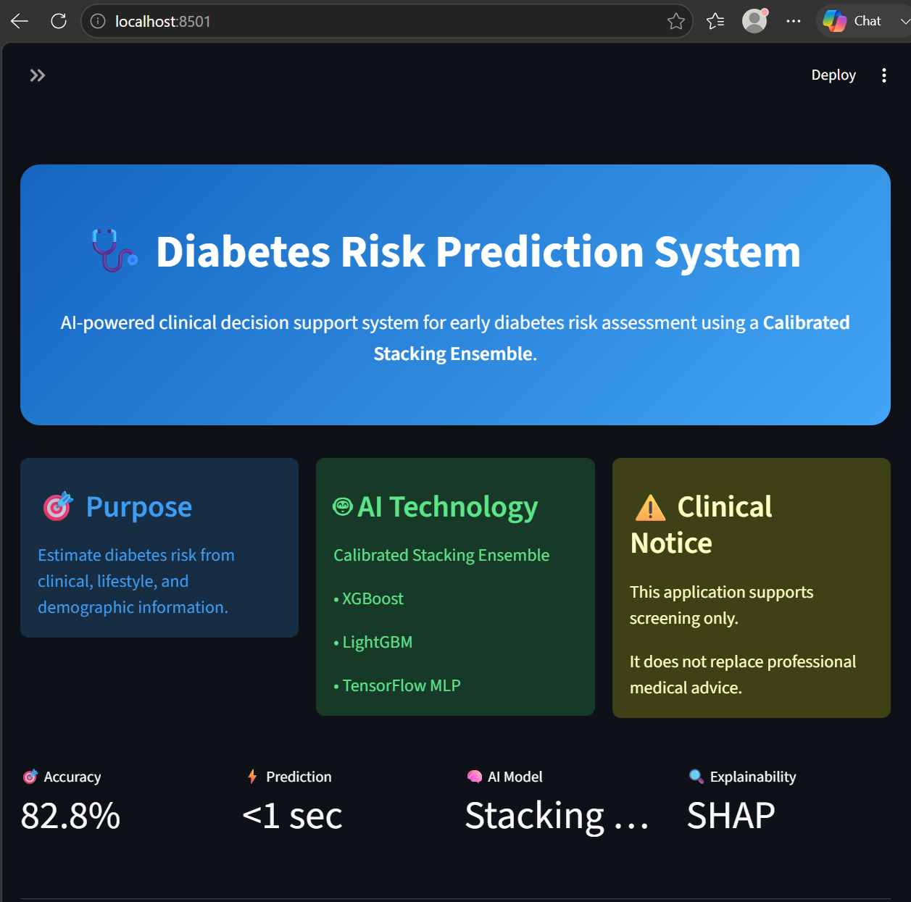
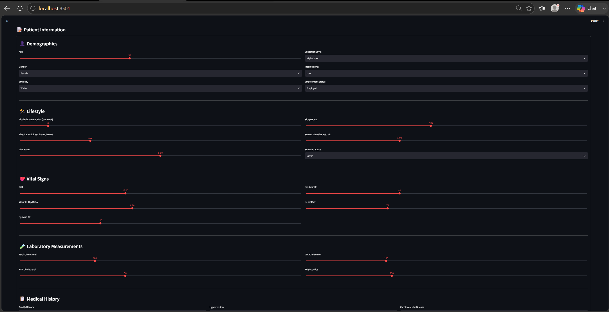
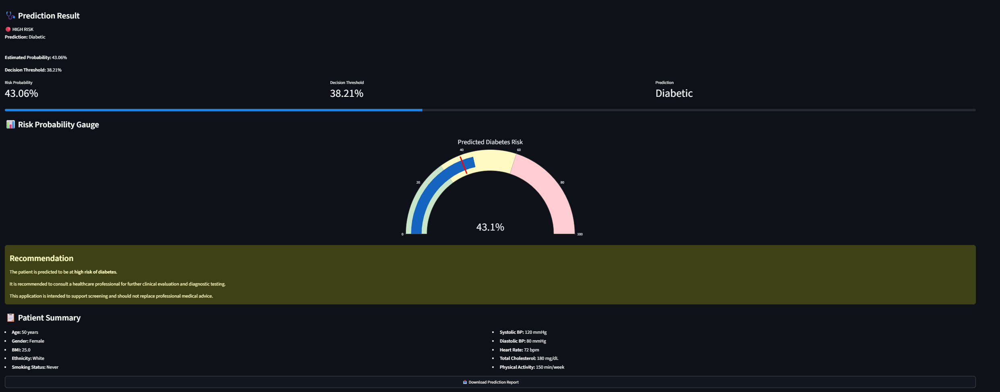
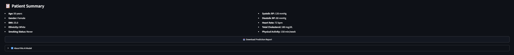

# DailyRise — Diabetes Risk Prediction


A machine learning web application that estimates diabetes risk from patient health data using a **calibrated stacking ensemble** of **XGBoost**, **LightGBM**, and a **Multi-Layer Perceptron (MLP)**.

Unlike many diabetes prediction demos that focus only on classification accuracy, this project emphasizes **probability calibration** and **model explainability**, producing predictions that are both reliable and interpretable through an interactive Streamlit interface.

---

## Live Demo

**[Try DailyRise on Streamlit Community Cloud →](https://diabetes-risk-prediction-wmxr7mqyazxysqbqhfdwkl.streamlit.app/)**

---

## Screenshots

> Add your screenshots after deployment.

### Home Page



### Patient Form



### Prediction Result



### Patient Summary



---

## Features

- Interactive Streamlit interface with a custom light/dark-adaptive theme
- Diabetes risk prediction from patient health information
- Calibrated probability estimation using Isotonic Regression
- Personalized health recommendations
- Patient summary dashboard
- Explainable AI using SHAP
- Modular preprocessing and inference pipeline
- Production-ready deployment structure

---

## Project Structure

```text
Diabetes-Risk-Prediction/
├── app/
│   ├── app.py
│   ├── forms.py
│   └── styles.css
├── models/
│   ├── preprocessor.pkl
│   ├── xgb.pkl
│   ├── lightgbm.pkl
│   ├── mlp.pkl
│   ├── meta.pkl
│   ├── calibrated.pkl
│   ├── threshold.pkl
│   ├── feature_names.pkl
│   ├── target_labels.pkl
│   └── metadata.json
├── samples/
│   ├── sample_input.csv
│   └── sample_output.csv
├── predict.py
├── requirements.txt
├── runtime.txt
├── README.md
└── DEPLOYMENT.md
```

---

## Dataset

This project uses two complementary datasets to develop and evaluate the proposed diabetes risk prediction model.

### 1. Synthetic Diabetes Dataset (Training Dataset)

The primary model was trained using the **Synthetic Diabetes Dataset** from the **Kaggle Tabular Playground Series – Season 5, Episode 12**. This large-scale synthetic dataset contains demographic, lifestyle, clinical, and medical history features associated with diabetes risk. It was used for data preprocessing, feature engineering, model training, hyperparameter optimization, probability calibration, and construction of the stacking ensemble.

### 2. BRFSS Dataset (External Validation)

To evaluate the generalization capability of the proposed model, external validation was performed using the **Behavioral Risk Factor Surveillance System (BRFSS)** dataset published by the **U.S. Centers for Disease Control and Prevention (CDC)**. The BRFSS dataset represents real-world health survey data and was used to assess the robustness and reliability of the trained model on an independent population.

### Model Features

The deployed model uses the following **24 input features**:

#### Demographic Information
- Age
- Gender
- Ethnicity
- Education Level
- Income Level
- Employment Status

#### Lifestyle Factors
- Alcohol Consumption (per week)
- Physical Activity (minutes per week)
- Diet Score
- Sleep Hours (per day)
- Screen Time (hours per day)
- Smoking Status

#### Clinical Measurements
- Body Mass Index (BMI)
- Waist-to-Hip Ratio
- Systolic Blood Pressure
- Diastolic Blood Pressure
- Heart Rate
- Total Cholesterol
- HDL Cholesterol
- LDL Cholesterol
- Triglycerides

#### Medical History
- Family History of Diabetes
- Hypertension History
- Cardiovascular Disease History

> **Note:** The deployed prediction model is trained using the Synthetic Diabetes Dataset, while the BRFSS dataset is used exclusively for external validation to demonstrate the model's ability to generalize across different data distributions.

The model is trained on patient-level health data covering demographic, lifestyle, clinical, and laboratory measurements associated with diabetes risk.

The application uses the following features:

**Demographics**
- Age
- Gender
- Ethnicity
- Education Level
- Income Level
- Employment Status

**Lifestyle**
- Alcohol Consumption (per week)
- Physical Activity (minutes per week)
- Diet Score
- Sleep Hours (per day)
- Screen Time (hours per day)
- Smoking Status

**Vital Signs**
- BMI
- Waist-to-Hip Ratio
- Systolic Blood Pressure
- Diastolic Blood Pressure
- Heart Rate

**Laboratory Measurements**
- Total Cholesterol
- HDL Cholesterol
- LDL Cholesterol
- Triglycerides

**Medical History**
- Family History of Diabetes
- Hypertension History
- Cardiovascular Disease History

The model is trained on the **Behavioral Risk Factor Surveillance System (BRFSS) Diabetes Health Indicators Dataset**, a large public health survey containing demographic, lifestyle, and health-related information associated with diabetes risk.

The application uses features including:

- Age
- Sex
- Body Mass Index (BMI)
- High Blood Pressure
- High Cholesterol
- Cholesterol Check History
- Smoking Status
- Stroke History
- Heart Disease
- Physical Activity
- Fruit Consumption
- Vegetable Consumption
- Heavy Alcohol Consumption
- Healthcare Access
- Difficulty Walking
- General Health
- Mental Health
- Physical Health
- Education
- Income

---

## Model Architecture

The prediction pipeline follows a stacked ensemble approach.

```text
Patient Information
        │
        ▼
Data Preprocessing
        │
        ▼
Stacking Ensemble
 ├── XGBoost
 ├── LightGBM
 └── Multi-Layer Perceptron
        │
        ▼
Logistic Regression Meta-Learner
        │
        ▼
Probability Calibration
        │
        ▼
Diabetes Risk Prediction
```

### Base Models

- XGBoost
- LightGBM
- Multi-Layer Perceptron (MLP)

### Meta-Learner

- Logistic Regression

### Probability Calibration

- Isotonic Regression (`CalibratedClassifierCV`)

### Explainability

- SHAP (SHapley Additive exPlanations)

---

## Performance Highlights

The project goes beyond standard classification by combining multiple complementary machine learning models with probability calibration.

Key highlights include:

- Stacking ensemble combining XGBoost, LightGBM, and MLP
- Calibrated probability estimates using Isotonic Regression
- Improved probability reliability for risk assessment
- Explainable predictions using SHAP
- Modular inference pipeline suitable for deployment

---

## Technology Stack

### Machine Learning

- Scikit-learn
- XGBoost
- LightGBM
- SHAP

### Web Application

- Streamlit
- HTML/CSS

### Python Libraries

- NumPy
- Pandas
- Joblib
- Matplotlib

---

## Installation

Clone the repository.

```bash
git clone https://github.com/SerahShiju/Diabetes-Risk-Prediction.git

cd Diabetes-Risk-Prediction
```

Create a virtual environment.

```bash
python -m venv venv
```

### Windows

```bash
venv\Scripts\activate
```

### macOS / Linux

```bash
source venv/bin/activate
```

Install the required dependencies.

```bash
pip install -r requirements.txt
```

Run the Streamlit application.

```bash
streamlit run app/app.py
```

---

## Usage

1. Launch the Streamlit application (or open the [live demo](https://diabetes-risk-prediction-wmxr7mqyazxysqbqhfdwkl.streamlit.app/)).
2. Enter the patient's health information.
3. Click **Predict Diabetes Risk**.
4. View:
   - Predicted diabetes risk
   - Calibrated probability
   - Personalized recommendation
   - Patient summary

Sample input and output files are available inside the `samples/` directory.

---

## Why Probability Calibration?

Many machine learning classifiers output confidence scores that are not true probabilities.

This project applies **Isotonic Regression** using **CalibratedClassifierCV** so that predicted probabilities better reflect real-world outcomes. For example, when the model predicts a 70% risk, that estimate is intended to correspond more closely to the observed frequency of diabetes among similar patients.

This makes the predictions more reliable for interpretation and demonstrates an important aspect of deploying machine learning models in healthcare applications.

---

## Future Improvements

- PDF prediction reports
- Batch prediction from CSV uploads
- REST API support
- Docker containerization
- User authentication
- Electronic Health Record (EHR) integration
- CI/CD using GitHub Actions

---

## License

This project is licensed under the MIT License.

---

## Author

**Serah Ann Shiju**

Master of Computer Applications (MCA)

Artificial Intelligence & Machine Learning Enthusiast

GitHub: https://github.com/SerahShiju

---

## Acknowledgements

This project was built using:

- Behavioral Risk Factor Surveillance System (BRFSS)
- Scikit-learn
- Streamlit
- XGBoost
- LightGBM
- SHAP

---

⭐ If you found this project interesting or useful, consider giving it a star!